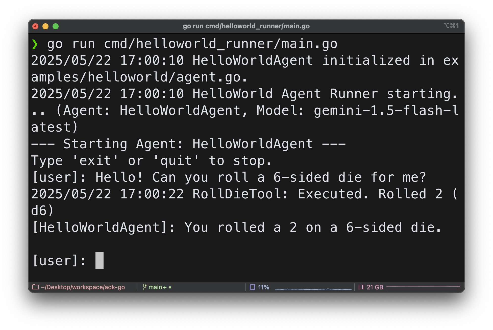

# ADK-Go: Agent Development Kit in Go (Migration In Progress)

<html>
    <h2 align="center">
      
    </h2>
    <h3 align="center">
      An open-source, code-first Go toolkit for building, evaluating, and deploying sophisticated AI agents with flexibility and control.
    </h3>
    <h3 align="center">
      Important Links:
      <a href="https://google.github.io/adk-docs/">Docs</a>
    </h3>
</html>

Welcome to ADK-Go

This repository is currently undergoing a migration from its original Python-based Agent Development Kit (ADK) to Go. The primary goal is to create a robust, performant, and idiomatic Go version of the ADK.

Please Note: This is an active development project. Many features from the Python ADK are not yet implemented or are in the process of being ported. The initial focus is on establishing a core, runnable agent interaction loop.

This README provides instructions to set up and run a **foundational "Hello World" agent example**. This example demonstrates the basic structure, core ADK concepts in Go, and interaction with Google's Gemini LLM.

## Project Structure

The project is structured to separate concerns, making it modular and scalable.

```plaintext
adk-go/
├── agents/                  # Agent definitions and interfaces
│   ├── base_llm_agent.go    # Base implementation for LLM-based agents
│   ├── sequential_agent.go  # Workflow agent for sequential execution
│   └── interfaces.go        # Core Agent and LlmAgent interfaces
├── cmd/
│   └── adk/
│       └── main.go          # Main CLI entrypoint for running agents
├── adk/
│   ├── runner.go           # SimpleCLIRunner for command-line interaction
├── models/
│   └── types/
│       └── types.go        # Core data structures (Message, Part, etc.)
├── llmproviders/
│   ├── gemini.go           # Gemini LLMProvider implementation
│   └── interfaces.go       # LLMProvider interface
├── tools/
│   ├── interface.go        # Tool interface
│   └── rolldie.go          # RollDieTool implementation
├── examples/
│   ├── helloworld/
│   │   └── agent.go        # Single agent example
│   └── sequential_weather/
│       └── agent.go        # Multi-agent workflow example
├── go.mod                  # Manages project dependencies
├── go.sum                  # Checksums for dependencies
└── README.md
```

As the migration progresses, other directories and files from your provided list (like `flows`, `auth`, `events`, etc.) will be populated and integrated.

## Prerequisites

- **Go**: Version 1.20 or later. ([Installation Guide](https://go.dev/doc/install))
- **Git**: For cloning the repository.
- **Google Cloud Project**: A Google Cloud Project with the Vertex AI API (or Generative Language API via Google AI Studio) enabled.
- **Gemini API Key**: An API key for Google Gemini.
  - Important: Secure your API key. Do not commit it directly into code. Use environment variables.
- **Environment Variable**: Set the `GEMINI_API_KEY` environment variable.

## Setup & Running the HelloWorld Agent

1. **Clone the Repository**

   Open your terminal and clone the project repository:

   ```bash
   git clone https://github.com/KennethanCeyer/adk-go.git
   cd adk-go
   ```

2. **Tidy Dependencies**

   Ensure all necessary Go modules are downloaded and the `go.mod` and `go.sum` files are up-to-date.

   ```bash
   go mod tidy
   ```

   This command will automatically download `github.com/google/generative-ai-go/genai` and its dependencies based on the imports in the Go files.

3. **Set `GEMINI_API_KEY` Environment Variable (if not already done, as described in "Prerequisites")**

4. **Run the HelloWorld Agent**

   From the `adk-go` root directory

   ```bash
   go run ./cmd/helloworld_runner/main.go
   ```

5. **Interact with the Agent**

   Once the runner starts, it will prompt you for input. Try the following.

   ```bash
   go run ./cmd/adk run -agent helloworld
   ```

   You will see output similar to this:

   ```
   --- Starting Agent: HelloWorldAgent ---
   Description: A simple agent that can roll a die using a tool.
   Model: gemini-1.5-flash-latest
   Available Tools:
     - roll_die: Rolls a die with a specified number of sides and returns the result.
   ------------------------------------
   Type 'exit' or 'quit' to stop.
   [user]: Hello! Can you roll a 6-sided die for me?
   [HelloWorldAgent]: You rolled a 5 on a 6-sided die.
   ```

   

6. **Run the Multi-Agent Example**

   To see the `SequentialAgent` in action, run the `sequential_weather` agent. This workflow will first greet you, then provide a simulated weather report.

   ```bash
   go run ./cmd/adk run -agent sequential_weather
   ```

   Interact with it by simply pressing Enter or typing any message to trigger the sequence.

## Building with ADK: Core Concepts

### Multi-Agent Systems

ADK is designed for building complex applications by composing multiple, specialized agents. This approach, known as a multi-agent system, allows for modular, scalable, and maintainable code. A root agent can delegate tasks to sub-agents, each optimized for a specific function.

ADK will support workflow agents to orchestrate these interactions in a predictable manner:

- **SequentialAgent**: Executes a series of sub-agents in a predefined order, perfect for creating pipelines where the output of one agent becomes the input for the next.
- **ParallelAgent**: Runs multiple sub-agents concurrently, useful for tasks that can be performed independently to reduce latency, such as fetching data from multiple sources at once.
- **LoopAgent**: Repeatedly executes its sub-agents until a specific condition is met, ideal for iterative refinement, polling for status, or any task requiring repetition.

These workflow agents provide deterministic control over the execution flow, while the sub-agents themselves can be intelligent `LlmAgent` instances.

## Next Steps & Contribution

This "Hello World" example serves as the initial building block. The next steps in the migration will involve:

- Implementing more core ADK features (e.g., advanced agent types like `SequentialAgent` and `LoopAgent`, session management, event handling, complex flows).
- Porting additional tools and planners.
- Adding comprehensive tests.
