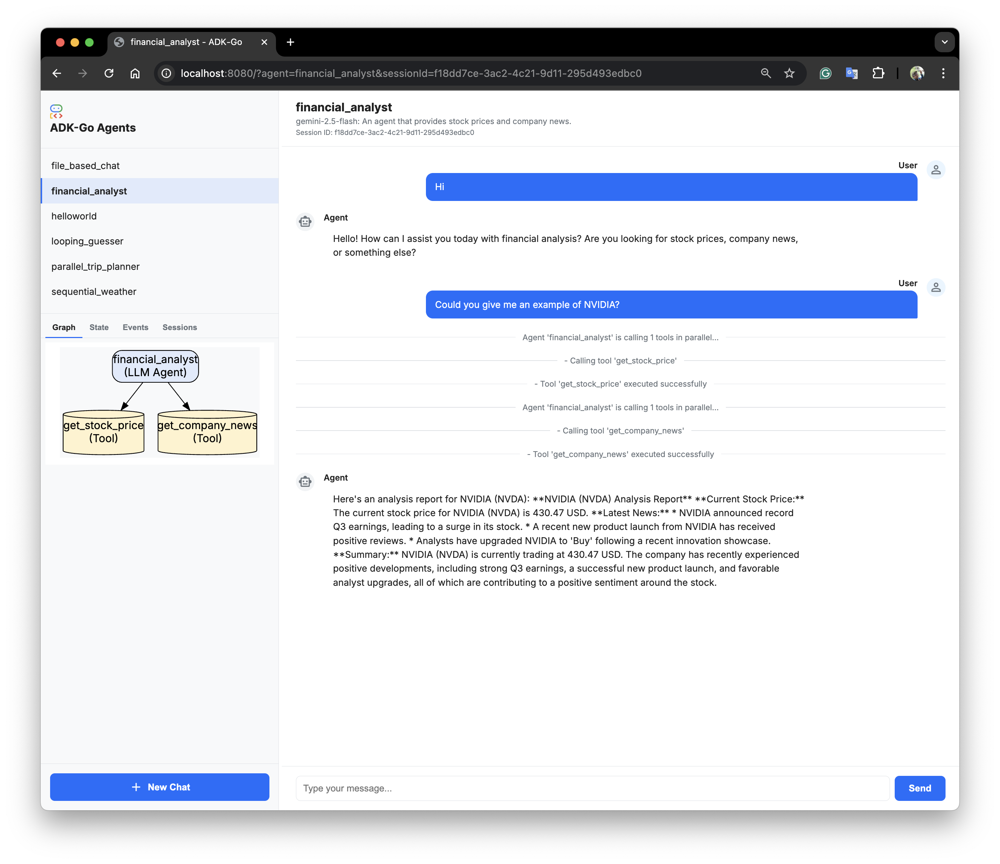

# ADK-Go: Agent Development Kit in Go (Migration In Progress)

<html>
  <h2 align="center">
    
  </h2>
  <h3 align="center">
    An open-source, code-first Go toolkit for building, evaluating, and deploying sophisticated AI agents with flexibility and control.
  </h3>
  <h3 align="center">
    Important Links:
    <a href="https://google.github.io/adk-docs/">Docs</a>
  </h3>
</html>

Welcome to ADK-Go
This repository is a Go implementation of the Agent Development Kit (ADK), designed for building, evaluating, and deploying sophisticated AI agents. It provides a code-first, modular framework for creating complex multi-agent systems with deterministic control flows.

This project is an ongoing effort to create a robust, performant, and idiomatic Go version of the original Python ADK. While many features are still being ported, the core functionality for building and running agents is in place.

This README provides instructions to set up the project, run the included examples, and understand the core concepts of building with ADK-Go.

## Project Structure

The project is structured to separate concerns, making it modular and scalable.

```plaintext
adk-go/
├── adk/
│   └── runner.go            # SimpleCLIRunner for command-line interaction
├── agents/                  # Core agent definitions and workflow agents
│   ├── interfaces/
│   │   └── interfaces.go
│   └── invocation/
│       └── context.go
├── common/
│   └── utils.go             # Common utility functions
├── cmd/
│   └── adk/
│       └── main.go          # Main CLI entrypoint for running agents
├── examples/                # Example agent implementations
│   ├── file_based_chat/
│   ├── helloworld/
│   ├── parallel_trip_planner/
│   ├── sequential_weather/
│   └── registry.go          # Central registry for all example agents
├── llmproviders/            # LLM provider implementations and interfaces
│   ├── gemini.go
│   └── interfaces.go
├── models/
│   └── types/
│       └── types.go        # Core data structures (Message, Part, etc.)
├── sessions/                # Session management for conversations
│   ├── session.go
│   └── store.go
├── tools/
│   ├── interface.go
│   ├── rolldie.go
│   └── example/
│       └── ... (flight_tool.go, hotel_tool.go, etc.)
├── web/                     # Web server and UI for agent interaction
│   ├── handler.go
│   ├── server.go
│   └── index.html
├── go.mod                  # Manages project dependencies
└── README.md
```

As the migration progresses, other directories and files from your provided list (like `flows`, `auth`, `events`, etc.) will be populated and integrated.

## Prerequisites

- **Go**: Version 1.20 or later. ([Installation Guide](https://go.dev/doc/install))
- **Git**: For cloning the repository.
- **Google Cloud Project**: A Google Cloud Project with the Vertex AI API (or Generative Language API via Google AI Studio) enabled.
- **Gemini API Key**: An API key for Google Gemini.
  - Important: Secure your API key. Do not commit it directly into code. Use environment variables.
- **Environment Variable**: Set the `GEMINI_API_KEY` environment variable.

## Setup & Running the HelloWorld Agent

1.  **Clone the Repository**

```bash
git clone https://github.com/KennethanCeyer/adk-go.git
cd adk-go
```

2.  **Tidy Dependencies**

```bash
go mod tidy
```

3.  **Set `GEMINI_API_KEY` Environment Variable** (if not already done)

4.  **Run Examples**

    

    The main entrypoint is `cmd/adk/main.go`, which provides a command-line interface (CLI) to run agents.

    All examples use a simple in-memory session store. When you run an agent, a new session ID is created. You can resume a previous conversation by providing this ID.

    #### a. Single Agent Example (`helloworld`)

    This is the most basic example of a single agent that uses a tool.

    ```bash
    go run ./cmd/adk run -agent helloworld
    # To resume a session:
    # go run ./cmd/adk run -agent helloworld -session-id <your-session-id>
    ```

    Once started, try asking it: `Can you roll a 20-sided die?`

    #### b. Sequential Agent Example (`sequential_weather`)

    This example demonstrates a single, capable agent that can either make small talk or use a tool to get a weather report based on the user's intent.

    ```bash
    go run ./cmd/adk run -agent sequential_weather
    ```

    Try a prompt like: `what is the weather in london?`

    #### c. Parallel Agent Example (`parallel_trip_planner`)

    This example showcases the `ParallelAgent`. It finds flights and hotels concurrently and then uses its own LLM to synthesize the results into a single travel plan.

    ```bash
    go run ./cmd/adk run -agent parallel_trip_planner
    ```

    Try a prompt like: `I want to book a trip to Tokyo on 2024-12-25.`

    #### d. Loop Agent Example (`looping_guesser`)

    This example demonstrates the `LoopAgent`, which repeatedly executes a sub-agent. In this case, it plays a number guessing game, making iterative guesses until it finds the correct number or runs out of attempts.

    ```bash
    go run ./cmd/adk run -agent looping_guesser
    ```

    Start the game with a prompt like: `guess the number`

    #### e. File-Based Chat Agent (`file_based_chat`)

    This example demonstrates an agent that can interact with the local filesystem. It can read from and write to files.

    ```bash
    go run ./cmd/adk/main.go run -agent file_based_chat
    ```

    Try prompts like: `write "hello world" to a file named hello.txt` and then `can you read the file hello.txt?`

## Running the Web Interface

ADK-Go includes a simple, real-time web interface for interacting with your agents. This provides a more user-friendly experience than the command-line runner.

To start the web server, use the `web` command. It hosts a general UI where you can select any registered agent.

```bash
# Start the web UI
go run ./cmd/adk web
```

    Then, open your web browser and navigate to `http://localhost:8080`. You will see a chat interface, titled with the agent's name, where you can interact with it. Each message (user, agent, error) is displayed, providing a clear view of the conversation state.

## Building with ADK: Core Concepts

### Multi-Agent Systems

ADK is designed for building complex applications by composing multiple, specialized agents. This approach, known as a multi-agent system, allows for modular, scalable, and maintainable code. A root agent can delegate tasks to sub-agents, each optimized for a specific function.

ADK will support workflow agents to orchestrate these interactions in a predictable manner:

- **SequentialAgent**: Executes a series of sub-agents in a predefined order, perfect for creating pipelines where the output of one agent becomes the input for the next.
- **ParallelAgent**: Runs multiple sub-agents concurrently and then synthesizes their outputs. This is useful for tasks that can be performed independently to reduce latency, such as fetching data from multiple sources at once.
- **LoopAgent**: Repeatedly executes its sub-agents until a specific condition is met, ideal for iterative refinement, polling for status, or any task requiring repetition.

These workflow agents provide deterministic control over the execution flow, while the sub-agents themselves can be intelligent `LlmAgent` instances.

## Next Steps & Contribution

This "Hello World" example serves as the initial building block. The next steps in the migration will involve:

- Implementing more core ADK features (e.g., advanced agent types like `LoopAgent`, session management, event handling, complex flows).
- Porting additional tools and planners.
- Adding comprehensive tests.
